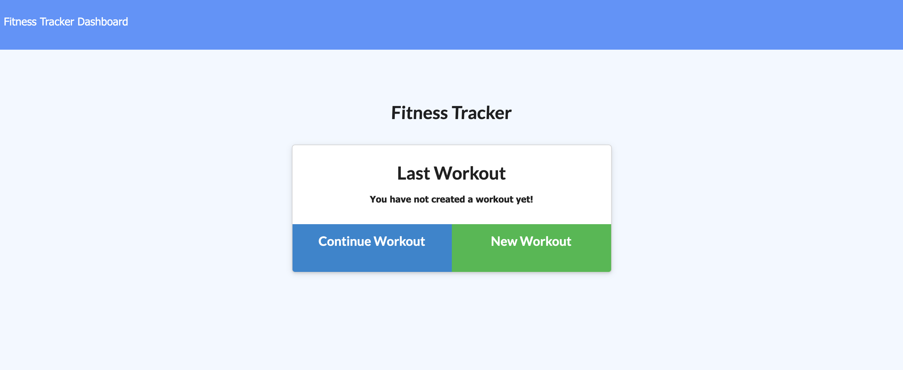
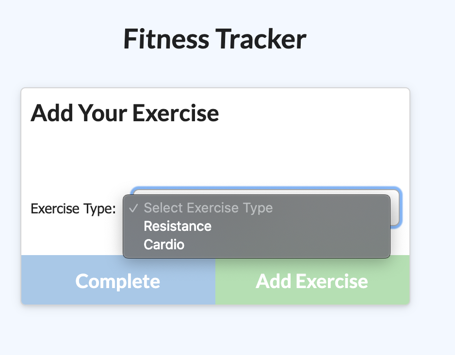
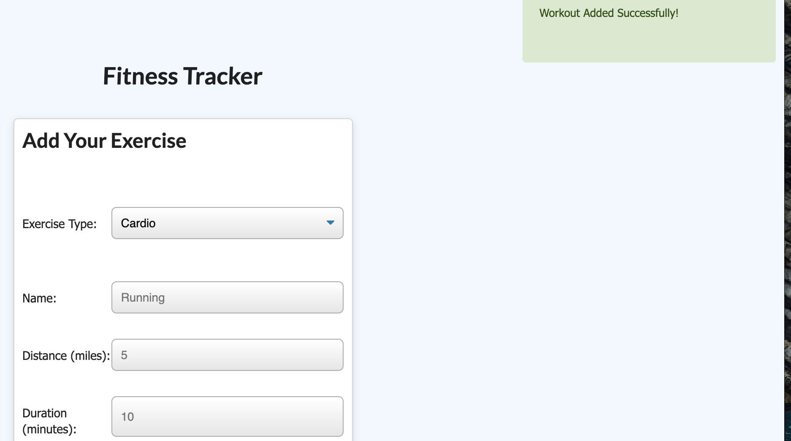
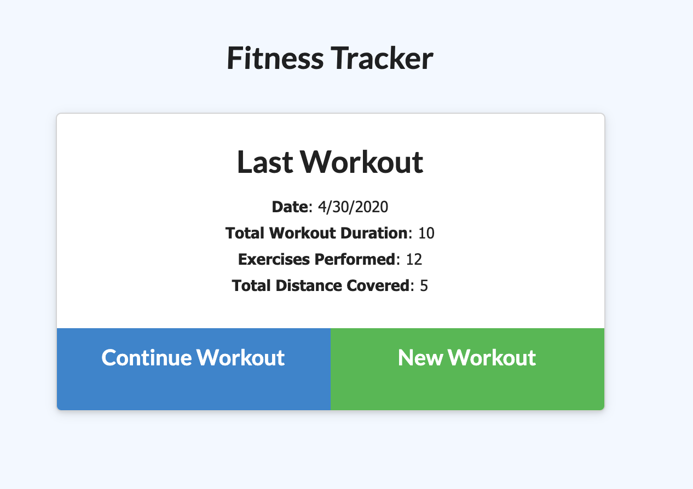

## Workout Tracker

## Description 
A workout tracker created by Mongo database with a mongoose schema, As a user, I want to be able to view create and track daily workouts. I want to be able to log multiple exercises in a workout on a given day. I should also be able to track the name, type, weight, sets, reps, and duration of exercise. If the exercise is a cardio exercise, I should be able to track my distance traveled.

In this workout tracker you are able to view and create the tracker to configure out what you want your gym routine to be. In this photo you are given a home screen with two buttons for continue workout and new workout.

In this next photo, when you click on add exercise you are given a dropdown menu which will ask you to select your exercise type. 

After choosing your exercise, for example here cardio, it will give you a form in which you have to fill out what you are doing in the cardio agenda. After completing on the right top corner you will be given an alert that you have stored the workout successfully!

After, going back to the home screen, after doing a couple exercises it will give you a last workout and total up your workout duration, how many exercises you've performed, and the total distance you have covered.

## Table of contents

* [Installation](#installation)
* [Usage](#usage)
* [License](#license)
* [Contributing](#contributing)
* [Tests](#tests)
* [Questions](#questions)

## Installation
Npm install

## Usage
its a application in order to satisfy their goals quicker when they track their workout progress

## Questions

If you have any questions about the repo, open an issue or contact (https://github.com/Kvnvn) directly at Kevinvunguyen95@gmail.com

